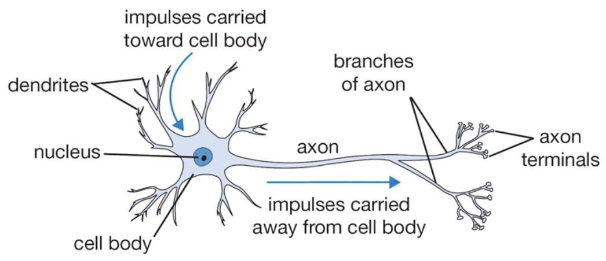
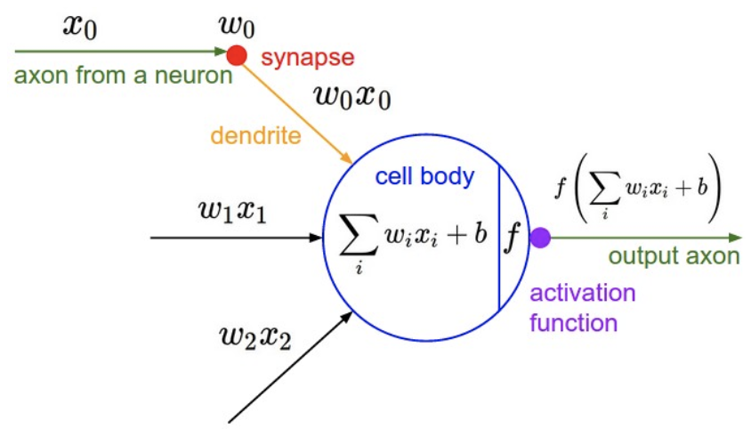
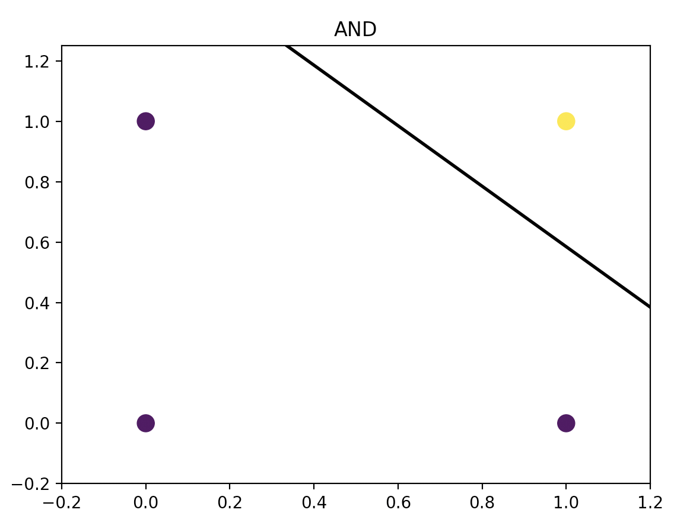
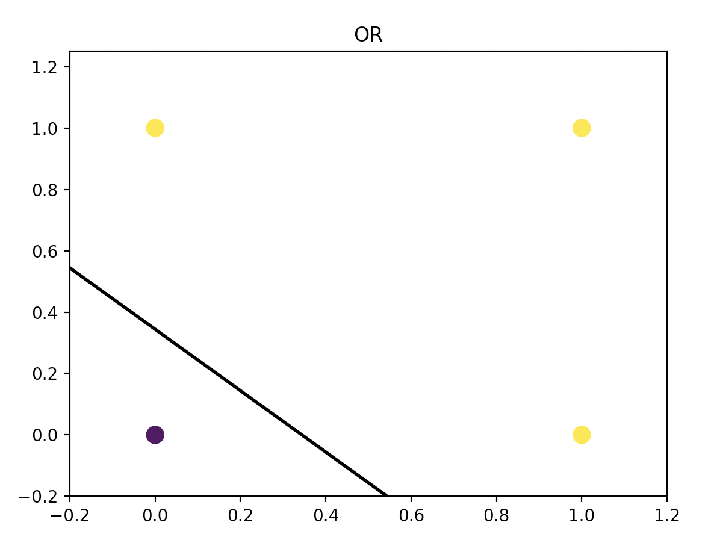
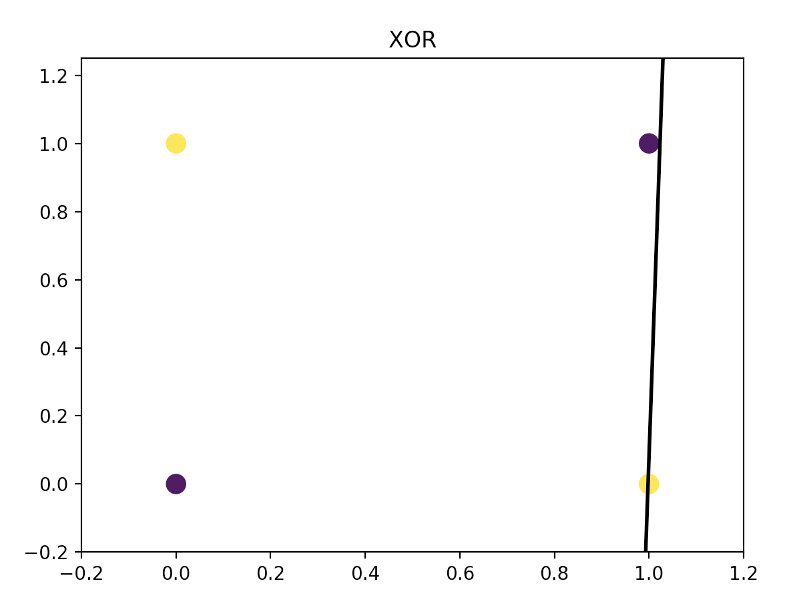

# Perceptron

Perceptron implemented in Python using (1) numpy and (2) TensorFlow 2

## So, what exactly is a Perceptron?

For us humans, learning occurs within the brain. If we understand how the brain works, it follows that we could try to model it for machine learning, right? So we ask ourselves: how exactly does the brain work?

The processing unit of the brain is the neuron. Transmitter chemicals within the fluid of the brain raise or lower the electrical potential inside the body of the neuron. If this membrane potential reaches some threshold, the neuron spikes or fires, and a pulse of fixed strength and duration is sent down the axon. The axons divide into connections to many other neurons; connecting to each of these neurons in a synapse. Each neuron is typically connected to thousands of other neurons.



Each neuron can be viewed as a separate processor, performing a very simple computation: deciding whether or not to fire. 

So how can we model a neuron? Let's look at a mathematical model of a neuron that was introduced in 1943 by Warren McCulloch and Walter Pitts. 



The input to the Perceptron is the weighted sum of inputs:

z = w0 + w1 * x1 + w2 * x2 + ... + xn * xn

We use the activation function to decide whether the output (we call this our hypothesis h) fires or not.

h = g(z) where g is the sigmoid function

As a side note, we can choose from *many* different activations functions. A very common one for machine learning is the sigmoid function, which we will use here.

It can hopefully be seen that the Perceptron creates a linear boundary to separate data. As such, we can use the Perceptron as a linear classifier. 

 A very popular example in machine learning is to train a percepton to learn logic functions (logic gates): AND, OR, etc. This is what we will do next.

```python
import numpy as np
import matplotlib.pyplot as plt

num_features = 2
num_iter = 2000
learning_rate = 0.01
```

Here, the learning rate (n) tells us how much to adjust our weights each iteration:

w <-- w - n(y-h)*x

```python
x = np.array([[0, 0], [1, 0], [1, 1], [0, 1]], np.float32) # input
# y = np.array([0, 0, 1, 0], np.float32) # AND
# y = np.array([0, 1, 1, 1], np.float32) # OR
y = np.array([0, 1, 0, 1], np.float32) # XOR

w = np.zeros(num_features, np.float32) # initialize weights as zeroes
w0 = np.zeros(1, np.float32) # initalize w0 as zero

m, n = np.shape(x) # number of samples m and number of features n

for k in range(num_iter):
    for j in range(m):
      g_z = x[j, :].dot(w) + w0  # sum of weighted inputs z
      h = 1.0 / (1.0 + np.exp(-g_z)) # hypothesis is sigmoid g(z)

      err = y[j] - h # error is expected output - hypothesis
      delta_w = err * x[j, :]
      delta_b = err
      w = w + learning_rate * delta_w  # update weights
      w0 = w0 + learning_rate * delta_b # update w0

# plot the fitted line; we only need two points to plot the line
plot_x = np.array([np.min(x[:, 0] - 0.2), np.max(x[:, 1] + 0.2)])
plot_y = - 1 / w[1] * (w[0] * plot_x + w0) # w0*x + w1*y + b = 0 --> y = (-1/w1) (w0*x + b)

print('W:' + str(w))
print('b:' + str(b))
print('plot_y: ' + str(plot_y))

plt.scatter(x[:, 0], x[:, 1], c=y, s=100, cmap='viridis')
plt.plot(plot_x, plot_y, color='k', linewidth=2)
plt.xlim([-0.2, 1.2]);
plt.ylim([-0.2, 1.25]);
plt.show()
```

Hopefully running this code visualizes that a Percepton can only classify input correctly if the data is linearly separable. The logical AND and OR are linearly separable, but the XOR is not. Try as it might, the Perceptron cannot separate the XOR.







To use a Perceptron to create a non-linear decision boundary, we would need a multi-layer perceptron. In this way a multilayer perceptron composes together many different functions.

f(x) = f3(f2(f1(x)))

## Author

**Laura Kocubinski** [laurakoco](https://github.com/laurakoco)

## Acknowledgments

* Boston University MET Master of Science Computer Science Program
* Machine Learning: An Algorithmic Perspective. Stephen Marshland.
* [Single Layer Percepton in TensorFlow](https://nasirml.wordpress.com/2017/11/19/single-layer-perceptron-in-tensorflow/)
* [Stanford CS231n Convolutional Neural Networks for Visual Recognition](http://cs231n.github.io/neural-networks-1/)
